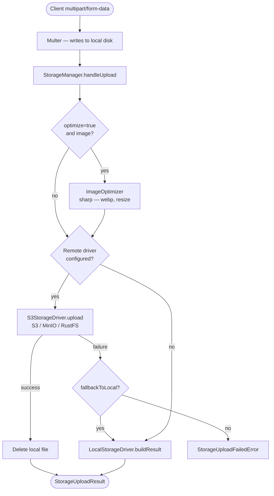
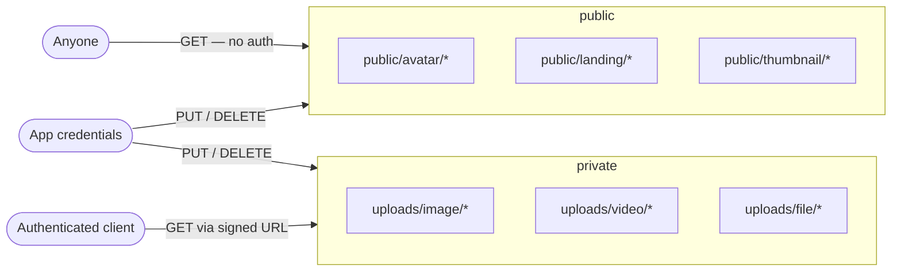
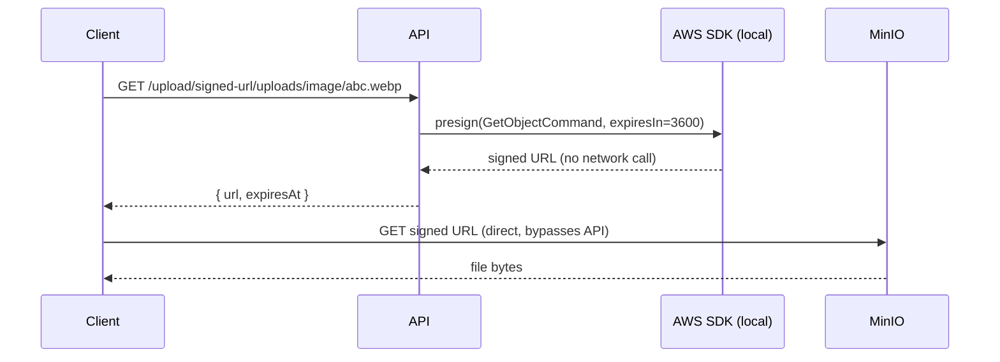
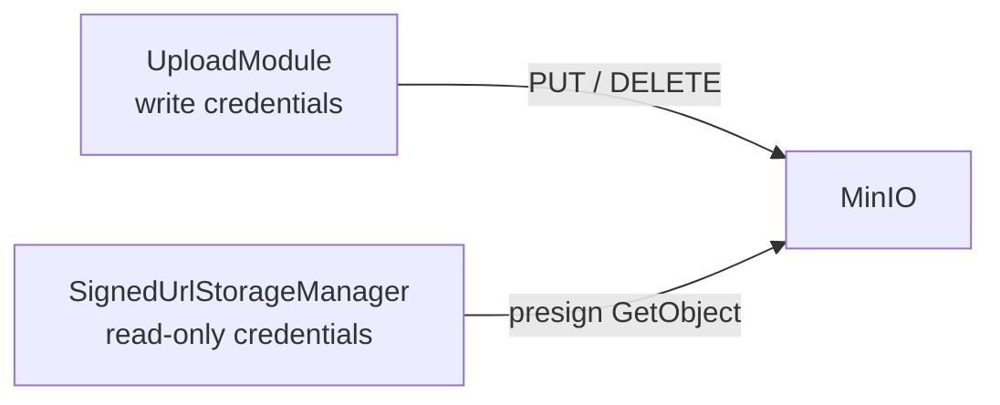

# Uploads & Storage — Overview

> Audience: backend, devops
> Scope: `packages/storage`, `apps/api/src/modules/upload`, `apps/api/src/utils/multer.ts`

---

## Architecture

The storage system uses a **local-first, remote-preferred** pattern. Files always land on local disk first (via Multer), then the `StorageManager` pushes them to the configured remote driver and cleans up the local copy on success.



---

## Driver System

The active driver is resolved at startup from the `STORAGE_DRIVER` env var, or detected automatically from which credentials are present.

| `STORAGE_DRIVER` | Behaviour |
|---|---|
| `local` | Always write to local disk, never attempt remote |
| `bucket` | Always use S3/MinIO — throws on startup if bucket config is missing |
| `auto` (default) | Uses bucket if credentials are present, otherwise local |

> **`auto` in production** — always set `STORAGE_DRIVER=bucket` explicitly in production. `auto` is for local development where bucket credentials may not be available.

---

## Folder Structure

Files are routed to different sub-folders based on `UploadType`, which determines both the local path Multer writes to **and** the S3 object key prefix.

```
{uploadRoot}/               ← local disk  (UPLOAD_LOCATION env)
bucket/                     ← MinIO bucket (STORAGE_BUCKET_NAME env)
├── public/                 ← publicly readable without authentication
│   ├── avatar/             ← user profile pictures
│   ├── landing/            ← landing page banners / hero images
│   └── thumbnail/          ← video / content thumbnails
└── uploads/                ← private — signed URLs only
    ├── image/              ← general private images
    ├── video/              ← private videos
    ├── file/               ← documents, CSVs, spreadsheets
    ├── pdf/
    └── xlsx/
```

The split is enforced in two places:

1. **Multer destination** (`apps/api/src/utils/multer.ts`) — reads `req.query.uploadType` and writes to the correct local sub-folder at request time.
2. **S3StorageDriver** (`packages/storage/src/drivers/s3-driver.ts`) — derives the S3 key from the local path, preserving the `public/` or `uploads/` prefix.

---

## Bucket Policy

On every app startup, `UploadService.onModuleInit()` calls `StorageManager.applyBucketPolicy()`, which applies a MinIO bucket policy that:

- Allows **anonymous `s3:GetObject`** on `public/*` — direct URLs work without any credentials.
- Leaves `uploads/**` fully private — only accessible via short-lived pre-signed URLs.



> The policy only adds `Allow s3:GetObject` for `public/*`. There is no explicit Deny for writes — anonymous writes are denied by default in MinIO when no explicit Allow exists for them.

---

## Signed URL Generation

Pre-signed URLs are generated using **HMAC-SHA256 locally** — no network round-trip to MinIO is required. The SDK signs the URL on the server and returns it to the client.



For public files (`public/*` prefix), no signing is needed — the API returns the direct CDN/bucket URL immediately.

---

## Optional: Read-only Credential Separation

For production, configure a second MinIO service account with only `s3:GetObject` rights and set `STORAGE_BUCKET_READONLY_*` credentials. The upload module will use this read-only account exclusively for signed URL generation. Even if a signed URL leaks, it cannot be used to upload or delete files.



> If `STORAGE_BUCKET_READONLY_ACCESS_KEY` is not set, the primary `StorageManager` is used for signing instead — functionally identical, just without the credential isolation.
