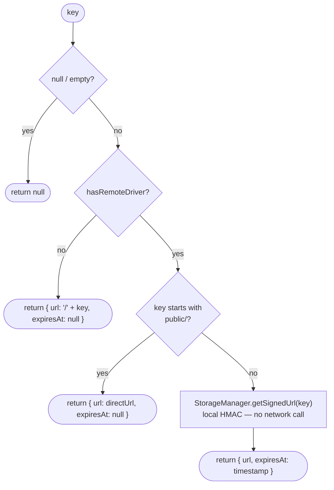

# StorageUrlResolver

> Audience: backend
> Scope: `apps/api/src/common/services/storage-url-resolver.service.ts`

---

## What it does

`StorageUrlResolver` is a shared injectable that converts a storage key (`relativePath`) into a ready-to-use URL. It abstracts away whether the file is stored locally or in S3/MinIO, and whether it needs a signed URL or is publicly accessible.

Feature services call `resolveFields` after fetching entities from the DB — the resolver mutates the objects in-place so controllers and serializers see `thumbnailUrl`, `thumbnailExpiresAt` etc. without any extra work.

---

## How to inject it

`StorageUrlResolver` is exported from `UploadModule`. Any feature module that needs URL resolution should import `UploadModule`:

```typescript
@Module({
  imports: [UploadModule],
  providers: [CourseService],
})
export class CourseModule {}
```

```typescript
@Injectable()
export class CourseService {
  constructor(
    private readonly storageUrlResolver: StorageUrlResolver,
  ) {}
}
```

---

## API

### `resolve(key, options?)`

Resolve a single key to a viewable URL.

```typescript
const result = await storageUrlResolver.resolve("public/avatar/abc.webp");
// { url: "http://minio:9000/apple/public/avatar/abc.webp", expiresAt: null }

const result = await storageUrlResolver.resolve("uploads/image/xyz.webp");
// { url: "http://minio:9000/...?X-Amz-...", expiresAt: 1712250000000 }

const result = await storageUrlResolver.resolve(null);
// null

const result = await storageUrlResolver.resolve("", { expiresIn: 7200 });
// null (empty string treated as null)
```

**Resolution rules:**



> **Signed URL generation is a local HMAC-SHA256 operation.** The AWS SDK computes the signature on the server without making a network request to MinIO. It is safe to call in hot paths (list endpoints, serializers).

---

### `resolveMany(keys, options?)`

Resolve an array of keys in parallel. Preserves index order. Nulls pass through.

```typescript
const results = await storageUrlResolver.resolveMany([
  "public/avatar/a.webp",
  null,
  "uploads/image/b.webp",
]);
// [
//   { url: "http://minio/.../public/avatar/a.webp", expiresAt: null },
//   null,
//   { url: "http://minio/...?X-Amz-...", expiresAt: 1712250000000 },
// ]
```

---

### `resolveFields(items, fields)`

Mutates each item in-place, adding `{field}Url` and `{field}ExpiresAt` for every field listed. The original key field is **preserved** so the DB key survives serialization for client-side cache keys.

```typescript
await storageUrlResolver.resolveFields(courses, ['thumbnail', 'previewVideo']);

// Before:
// { id: 1, thumbnail: "public/thumbnail/abc.webp", previewVideo: "uploads/video/xyz.mp4" }

// After:
// {
//   id: 1,
//   thumbnail: "public/thumbnail/abc.webp",        // original key — still here
//   thumbnailUrl: "http://minio/.../public/...",    // added
//   thumbnailExpiresAt: null,                       // added (public — never expires)
//   previewVideo: "uploads/video/xyz.mp4",          // original key — still here
//   previewVideoUrl: "http://minio/...?X-Amz-...",  // added
//   previewVideoExpiresAt: 1712250000000,            // added (private — expires)
// }
```

Accepts a single object or an array — both work:

```typescript
// Single object
await storageUrlResolver.resolveFields(user, ['avatar']);

// Array
await storageUrlResolver.resolveFields(posts, ['thumbnail', 'cover']);
```

---

## Usage patterns

### Pattern 1: Inline before return

```typescript
async findAll(): Promise<CourseDto[]> {
  const courses = await this.db.query.course.findMany({ ... });
  await this.storageUrlResolver.resolveFields(courses, ['thumbnail', 'previewVideo']);
  return courses;
}
```

### Pattern 2: Single entity

```typescript
async findOne(id: string): Promise<UserProfileDto> {
  const user = await this.db.query.user.findFirst({ where: eq(user.id, id) });
  await this.storageUrlResolver.resolveFields(user, ['avatar', 'coverImage']);
  return user;
}
```

### Pattern 3: Explicit resolve for upload response

Upload responses already include `url` and `expiresAt` — `mapUploadResult` in `UploadService` calls `resolve` automatically. No extra work needed after upload.

```typescript
// Response from POST /upload includes:
{
  "relativePath": "uploads/image/abc.webp",  // store this in DB
  "url": "http://minio/...?X-Amz-...",       // use this immediately
  "expiresAt": 1712250000000
}
```

---

## Frontend caching guidance

The `expiresAt` field tells the frontend whether to cache the URL and when to refresh it.

```typescript
interface CachedUrl {
  url: string;
  expiresAt: number | null; // null = never expires (public or local)
}

const cache = new Map<string, CachedUrl>();
const BUFFER_MS = 60_000; // refresh 1 min before expiry

function isFresh(cached: CachedUrl): boolean {
  if (cached.expiresAt === null) return true; // public — never stale
  return cached.expiresAt > Date.now() + BUFFER_MS;
}
```

> Public files (`public/avatar`, `public/thumbnail`, `public/landing`) always return `expiresAt: null`. The frontend can cache these URLs forever — they are stable, permanent URLs that do not expire.
