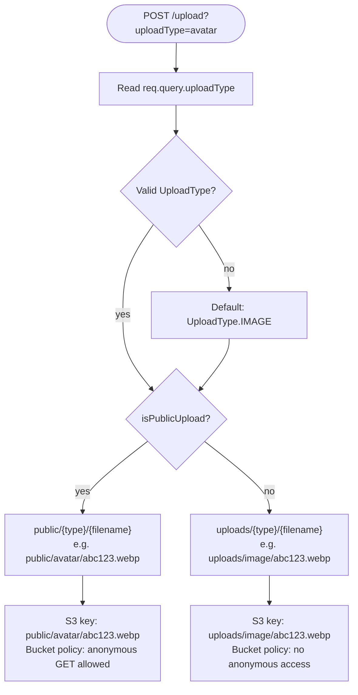

# Upload Types

> Audience: backend, frontend
> Scope: `packages/storage/src/upload-type.ts`, `apps/api/src/utils/multer.ts`

---

## The `UploadType` Enum

Every upload must declare its intent via `?uploadType=` query parameter. This controls:

1. Which sub-folder Multer writes to on local disk.
2. Which S3 key prefix is used (and therefore whether the bucket policy makes it publicly readable).
3. Whether `StorageUrlResolver` returns a **direct URL** (public) or generates a **pre-signed URL** (private).

```typescript
export enum UploadType {
  // Public — stored under public/, accessible without auth
  AVATAR    = "avatar",     // User profile pictures
  LANDING   = "landing",    // Landing page banners, hero images
  THUMBNAIL = "thumbnail",  // Video / content thumbnails

  // Private — stored under uploads/, requires signed URL
  IMAGE     = "image",      // General private images
  VIDEO     = "video",      // Private videos
  FILE      = "file",       // Documents, CSVs, spreadsheets
}
```

---

## Public vs Private

| Upload Type | S3 Prefix | Publicly Accessible | URL Type | `expiresAt` |
|---|---|---|---|---|
| `avatar` | `public/avatar/` | ✅ Yes | Direct URL | `null` |
| `landing` | `public/landing/` | ✅ Yes | Direct URL | `null` |
| `thumbnail` | `public/thumbnail/` | ✅ Yes | Direct URL | `null` |
| `image` | `uploads/image/` | ❌ No | Signed URL | timestamp |
| `video` | `uploads/video/` | ❌ No | Signed URL | timestamp |
| `file` | `uploads/file/` | ❌ No | Signed URL | timestamp |

---

## How Routing Works



The routing logic lives in the Multer `destination` callback in `apps/api/src/utils/multer.ts`:

```typescript
destination: (req, _file, cb) => {
  const raw = req.query?.uploadType;
  const uploadType =
    raw && Object.values(UploadType).includes(raw as UploadType)
      ? (raw as UploadType)
      : UploadType.IMAGE; // safe default

  const subdir = isPublicUpload(uploadType)
    ? path.join("public", uploadType)   // → public/avatar/
    : path.join("uploads", uploadType); // → uploads/image/

  cb(null, path.join(multerConfig.dest, subdir));
}
```

> **Multer has access to `req.query`** because Express parses URL query params before the Multer interceptor runs. The `uploadType` is available without any middleware.

---

## Customer vs Admin Upload Types

The mobile endpoint (`POST /mobile/uploads`) restricts the allowed values to `CustomerUploadType` to prevent customers from writing to admin-only folders like `landing` or `thumbnail`.

```typescript
// Admin endpoints — all UploadType values
enum UploadType { AVATAR, LANDING, THUMBNAIL, IMAGE, VIDEO, FILE }

// Mobile/customer endpoint — restricted subset
enum CustomerUploadType { AVATAR, IMAGE, FILE }
```

The values are identical strings — `CustomerUploadType.AVATAR === "avatar"`. The restriction is enforced via `@IsEnum(CustomerUploadType)` on the query DTO.

---

## Helper Functions

```typescript
import { isPublicUpload, getUploadPrefix, UploadType } from '@bullhouse/storage';

isPublicUpload(UploadType.AVATAR)    // true
isPublicUpload(UploadType.IMAGE)     // false

getUploadPrefix(UploadType.AVATAR)   // "public/avatar"
getUploadPrefix(UploadType.VIDEO)    // "uploads/video"
```

---

## Resolving a Key Back to a URL

Once a key is stored in the database (e.g. `public/avatar/abc123.webp`), call `StorageUrlResolver.resolve(key)`:

- **Public key** → returns direct URL from bucket, `expiresAt: null`
- **Private key** → returns pre-signed URL with expiry timestamp
- **Local driver** → returns `/${key}` with `expiresAt: null`

See [StorageUrlResolver](/docs/developer/uploads/storage-url-resolver) for full details.
