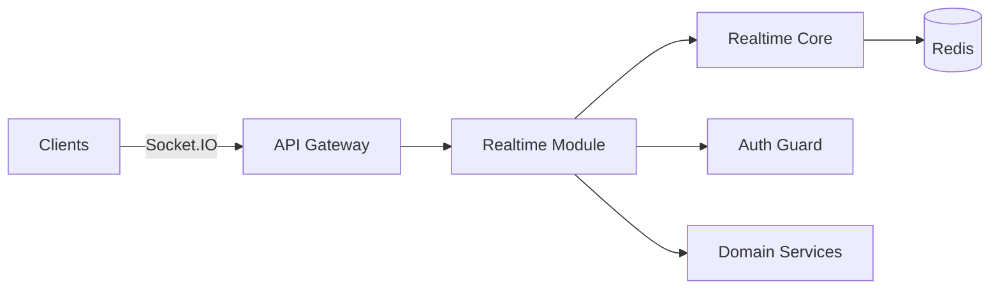
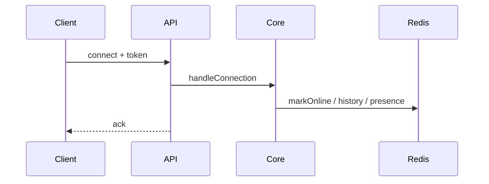

This system separates framework-agnostic realtime logic from framework adapters so you can reuse the same core across NestJS, Express, and other servers.

## Overview

- `@bullhouse/realtime-core` contains business logic, room conventions, event models, and utilities.
- The NestJS API imports the core and wires it to Socket.IO, Redis, auth, and health checks.

## Core Boundaries

- **Core**: framework-neutral, no NestJS/Express dependencies.
- **Adapter**: framework-specific wiring (NestJS modules, gateways, guards).
- **Clients**: Flutter/web/mobile subscribe to rooms and handle events.

## Redis Role

Redis is used for presence, event history, and Socket.IO scaling via the Redis adapter.

