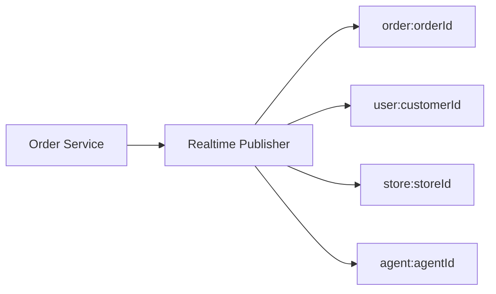

This catalog documents the current event names, payload schemas, rooms, and priority levels.

## Event Envelope

All events use the same envelope:

```json
{
  "event": {
    "id": "uuid",
    "type": "order.status_changed",
    "priority": "NORMAL",
    "timestamp": 1735689600000,
    "payload": {},
    "meta": {}
  },
  "requiresAck": false
}
```

## Event Catalog

| Event | Payload | Rooms | Priority |
| --- | --- | --- | --- |
| `order.status_changed` | `{ orderId: string, status: string }` | `order:{orderId}`, `user:{customerId}`, `store:{storeId}`, `agent:{agentId}` | `NORMAL` |
| `inventory.stock_updated` | `{ storeId: string, productId: string, stock: number }` | `store:{storeId}`, `product:{productId}` | `NORMAL` |
| `delivery.assigned` | `{ orderId: string, agentId: string }` | `order:{orderId}`, `agent:{agentId}` | `HIGH` |
| `agent.location_updated` | `{ agentId: string, location: { lat: number, lng: number, accuracy?: number } }` | `agent:{agentId}`, `zone:{zoneId}:agents` | `HIGH` |

## Priority Levels

- `CRITICAL`: paging events, delivery or payment failures.
- `HIGH`: assignment, dispatch, location updates.
- `NORMAL`: status updates and stock changes.

## Event Fanout


