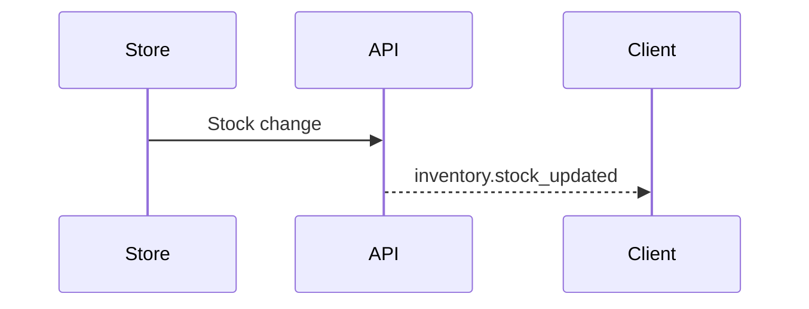

## Order Tracking

```ts
realtimeService.notifyOrderStatusChange(orderId, "ready", {
	customerId,
	storeId,
	agentId,
});
```

## Agent Coordination

```ts
realtimeService.notifyDeliveryAssigned(orderId, agentId);
realtimeService.notifyAgentLocationUpdate(agentId, {
	lat: 27.7172,
	lng: 85.3240,
});
```

## Stock Alerts

```ts
realtimeService.notifyStockUpdate(storeId, productId, stockCount);
```


