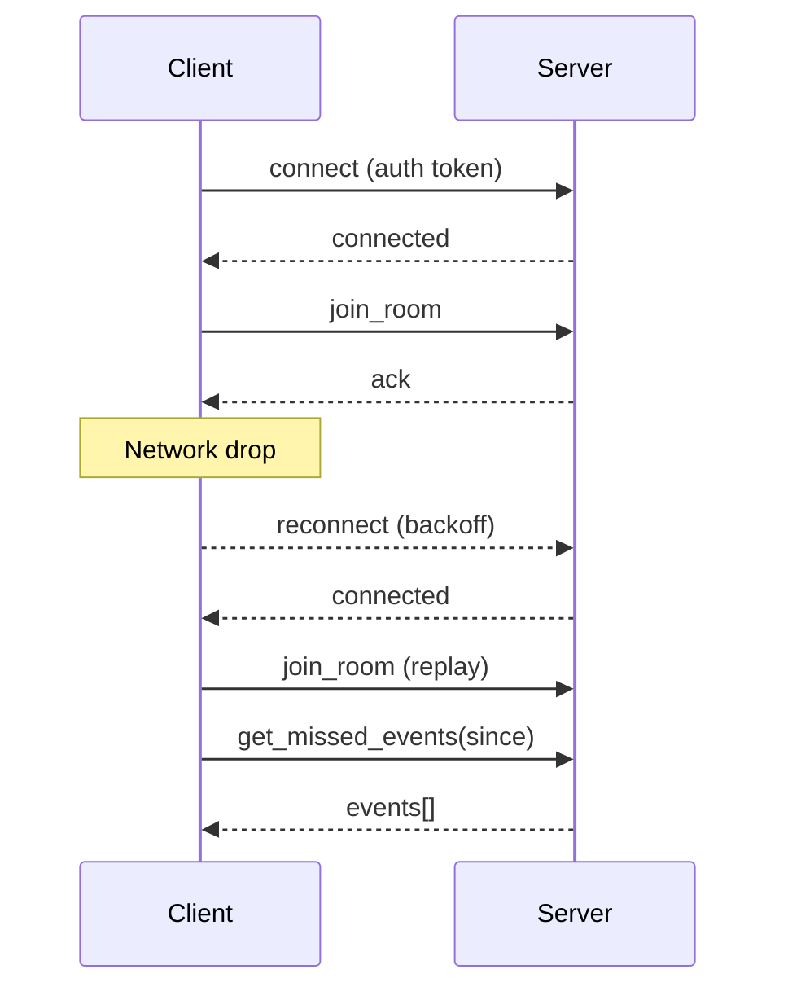
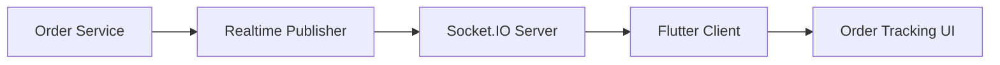

This guide documents how Flutter clients connect to the bullhouse realtime system, subscribe to rooms, and handle events reliably.

## Package Setup

Use the `socket_io_client` package in Flutter:

```yaml
dependencies:
  socket_io_client: ^2.0.3
  flutter_secure_storage: ^9.0.0
```

## Connection Example

Inject the access token from secure storage into the Socket.IO handshake `auth` object.

```dart
import 'package:socket_io_client/socket_io_client.dart' as IO;
import 'package:flutter_secure_storage/flutter_secure_storage.dart';

class RealtimeClient {
  final _storage = const FlutterSecureStorage();
  IO.Socket? _socket;

  Future<void> connect(String baseUrl) async {
    final token = await _storage.read(key: 'accessToken');

    _socket = IO.io(
      '$baseUrl/realtime',
      IO.OptionBuilder()
          .setTransports(['websocket'])
          .setAuth({'token': token})
          .disableAutoConnect()
          .build(),
    );

    _socket!.connect();

    _socket!.onConnect((_) {
      print('realtime connected');
    });

    _socket!.onDisconnect((_) {
      print('realtime disconnected');
    });
  }

  void disconnect() {
    _socket?.disconnect();
    _socket = null;
  }
}
```

## Room Key Naming Conventions

Room names follow predictable keys. These are defined in the core package and reused across clients.

- `user:{userId}`
- `order:{orderId}`
- `store:{storeId}`
- `store:{storeId}:orders`
- `zone:{zoneId}`
- `zone:{zoneId}:agents`
- `agent:{agentId}`
- `agent:{agentId}:orders`
- `product:{productId}`
- `variant:{variantId}`
- `orders:active`
- `agents:all`
- `stores:all`
- `store:{storeId}:zone:{zoneId}`
- `dashboard:admin`

## Subscribe / Unsubscribe Patterns

The server exposes room join/leave events. Use these in your Flutter client.

```dart
void joinRoom(String room) {
  _socket?.emitWithAck('join_room', {'room': room});
}

void leaveRoom(String room) {
  _socket?.emitWithAck('leave_room', {'room': room});
}
```

## Event Envelope (JSON Schema)

Realtime payloads use a consistent envelope so clients can track ordering and missed events.

```json
{
  "event": {
    "id": "uuid",
    "type": "order.status_changed",
    "priority": "NORMAL",
    "timestamp": 1735689600000,
    "payload": {
      "orderId": "ord_123",
      "status": "confirmed"
    },
    "meta": {
      "source": "api"
    }
  },
  "requiresAck": false
}
```

### Event Types

- `order.status_changed`
- `inventory.stock_updated`
- `delivery.assigned`
- `agent.location_updated`

### Example Payloads

```json
{
  "type": "order.status_changed",
  "payload": { "orderId": "ord_123", "status": "ready" }
}
```

```json
{
  "type": "inventory.stock_updated",
  "payload": { "storeId": "store_10", "productId": "prod_9", "stock": 18 }
}
```

```json
{
  "type": "delivery.assigned",
  "payload": { "orderId": "ord_123", "agentId": "agent_7" }
}
```

```json
{
  "type": "agent.location_updated",
  "payload": { "agentId": "agent_7", "location": { "lat": 27.7172, "lng": 85.3240 } }
}
```

## TypeScript to Dart Type Mapping

| TypeScript | Dart |
| --- | --- |
| `string` | `String` |
| `number` | `num` (or `int`/`double`) |
| `boolean` | `bool` |
| `Record<string, T>` | `Map<String, T>` |
| `T[]` | `List<T>` |
| `unknown` | `dynamic` |
| `Date` (ISO) | `DateTime.parse(...)` |

Define Dart models mirroring the JSON payloads and deserialize with `fromJson` helpers.

## Presence and Location Updates

```dart
void updateLocation(double lat, double lng, {double? accuracy}) {
  _socket?.emitWithAck('update_location', {
    'lat': lat,
    'lng': lng,
    if (accuracy != null) 'accuracy': accuracy,
  });
}
```

## Order Tracking Example

```dart
void subscribeOrder(String orderId) {
  joinRoom('order:$orderId');

  _socket?.on('order.status_changed', (data) {
    final payload = data['event']['payload'];
    print('Order ${payload['orderId']} status: ${payload['status']}');
  });
}
```

## Stock Alert Example

```dart
void subscribeStock(String storeId, String productId) {
  joinRoom('store:$storeId');
  joinRoom('product:$productId');

  _socket?.on('inventory.stock_updated', (data) {
    final payload = data['event']['payload'];
    print('Stock updated: ${payload['stock']}');
  });
}
```

## Offline Handling Strategy

- Queue outbound messages while offline.
- Reconnect with exponential backoff (1.5x delay, max 5 attempts).
- On reconnect, re-join rooms and fetch missed events per room.

```dart
Future<void> fetchMissedEvents(String room, int sinceEpochMs) async {
  final response = await _socket?.emitWithAck('get_missed_events', {
    'room': room,
    'since': sinceEpochMs,
  });

  // response: { ok: true, data: { events: [...] } }
}
```

## Reconnect and Replay



## Event Flow


