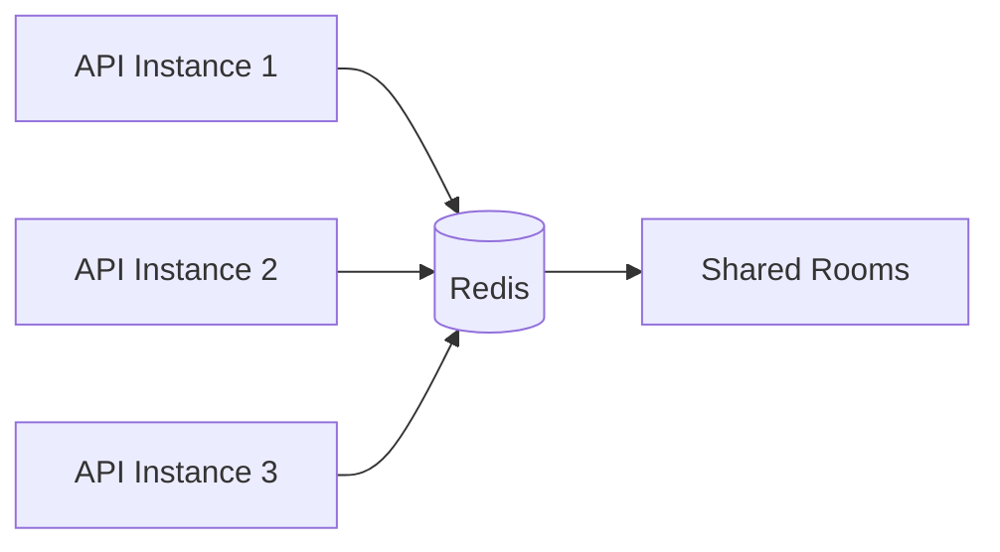
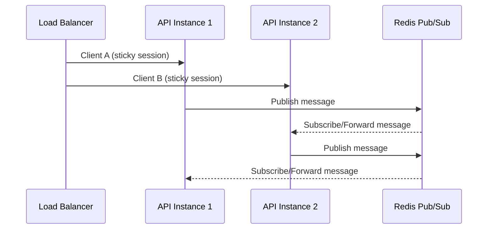

Scale the realtime layer using Redis, sticky sessions, and horizontal replicas.

## Redis Adapter

Use the Socket.IO Redis adapter so rooms and broadcasts are shared across instances.

## Load Balancer (Sticky Sessions)

Socket.IO requires sticky sessions so the same client consistently hits the same instance.

- Enable cookie-based or IP-hash affinity on your load balancer.
- Keep the Redis adapter enabled for cross-instance broadcasts.

## Horizontal Scaling Strategy

- Scale API pods horizontally based on connection counts.
- Keep Redis in a dedicated cluster with replication and persistence.
- Use connection limits per user to avoid abuse.

## Monitoring Setup

- Track active connections, emit rates, and Redis latency.
- Alert on connection errors and high event backlog.

