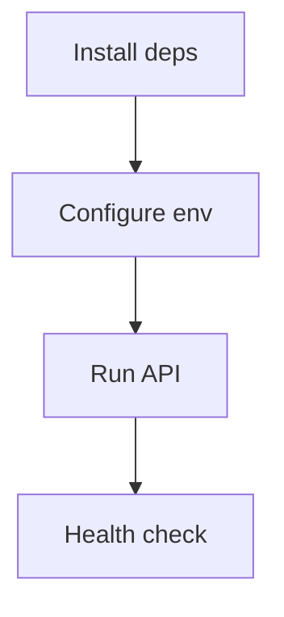

This guide walks through installing dependencies and configuring the API for realtime Socket.IO.

## Install Dependencies

```bash
pnpm --filter @bullhouse/api add socket.io @nestjs/websockets @nestjs/platform-socket.io @socket.io/redis-adapter
pnpm --filter @bullhouse/realtime-core add -D jest ts-jest @types/jest ioredis-mock
```

## Configure Environment

Add realtime variables in `apps/api/.env` (or `.env.example`).

```ini
WS_ORIGINS=http://localhost:3000
WS_NAMESPACE=/realtime
WS_RATE_LIMIT_MAX_CONNECTIONS=100
WS_RATE_LIMIT_PER_MINUTE=100
EVENT_HISTORY_ENABLED=true
EVENT_HISTORY_TTL=3600
ACK_TIMEOUT=10000
ACK_RETRIES=0
WS_AUTH_DISABLED=false
```

## Run the API

```bash
pnpm --filter @bullhouse/api dev
```

## Validate Health

```bash
curl http://localhost:5000/api/health/realtime
```

## Mermaid: Setup Flow


