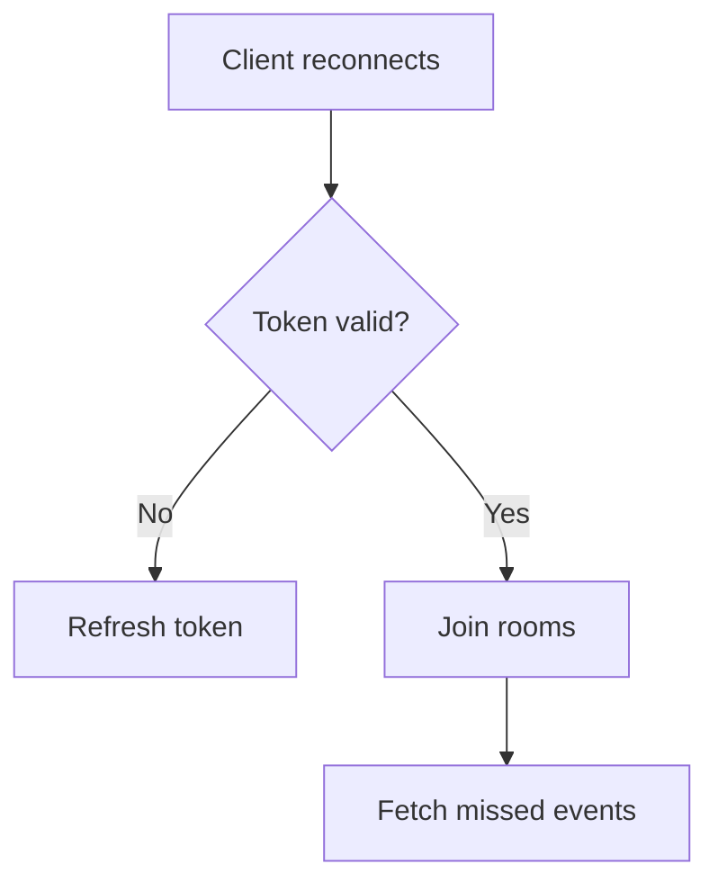

## Connection Failures

**Symptoms**: `connect_error`, repeated reconnects.

**Checks**
- Confirm namespace (`/realtime`) and origin settings.
- Verify access token validity for mobile clients.
- Ensure sticky sessions are enabled in the load balancer.

## Auth Errors

**Symptoms**: `unauthorized`, immediate disconnect.

**Checks**
- Access token expired; refresh before reconnect.
- User session revoked on the server.
- Clock skew between client and server.

## Message Loss

**Symptoms**: events missing after reconnect.

**Checks**
- Event history enabled (`EVENT_HISTORY_ENABLED=true`).
- Clients call `get_missed_events` with last seen timestamp.
- Redis TTL too short for your reconnect window.

## High Latency

**Symptoms**: delayed event delivery.

**Checks**
- Redis latency or connection saturation.
- Load balancer not using sticky sessions.
- Excessive payload sizes or large room fanouts.

