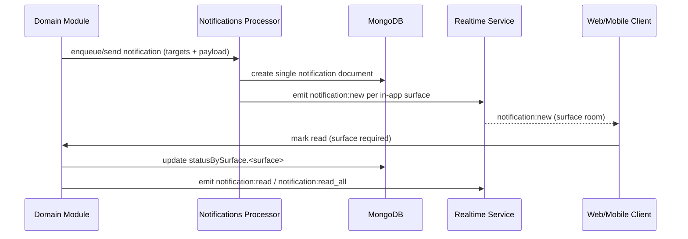

# Notification Workflow Overview

This workflow explains how one notification event moves from producer to user inbox with surface isolation.

## Surfaces

Supported surfaces:

- `web_in_app`
- `mobile_in_app`
- `web_push`
- `mobile_push`
- `email`
- `sms`

## Core Flow

## User Interaction Rules

- Inbox APIs require `surface` for list, unread count, read, and mark-all-read.
- Read state is isolated per surface.
- Marking read on `web_in_app` does not change `mobile_in_app` unless explicitly requested by product logic.
- Badge semantics are read-based.

## Reconnect Behavior

- Client rejoins room via `notification:join` or `notification:sync`.
- Server replays missed events from event history.
- Client can refetch inbox when a replay gap is detected.
